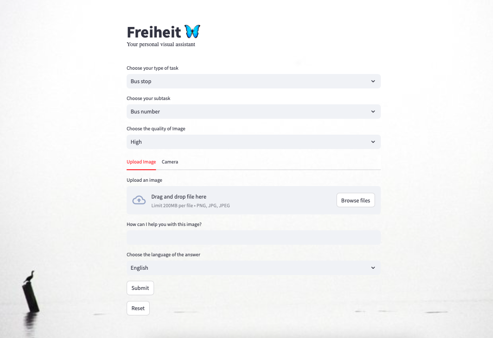
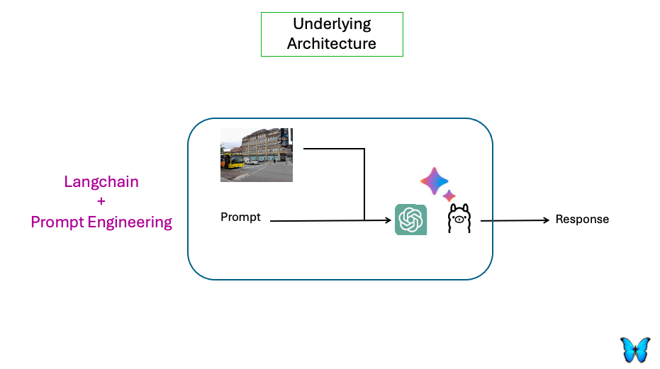
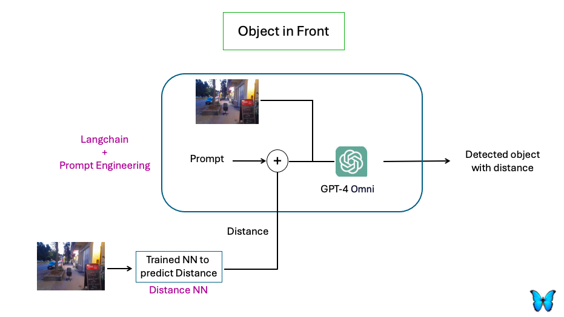
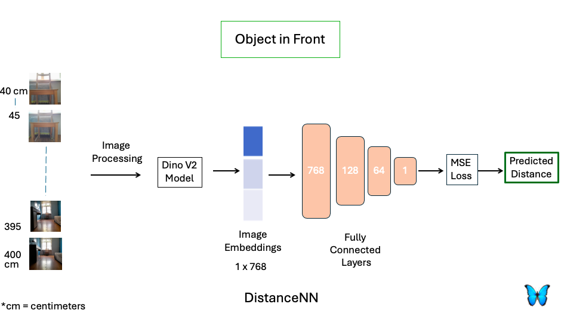

# Freiheit 🦋

Freiheit (English: 'Freedom') is an initiative designed to assist blind and visually impaired individuals with their daily tasks, fostering greater independence. Freiheit incorporates various use cases from daily life, which are identified by exploring different sources.

Freiheit utilizes multimodal models in backend to recognize images or texts and also predicts the distance of the object in front using either a multimodal model or a trained Neural Network. The inferences for each use case are refined through prompt engineering, using datasets specifically created for these applications. Currently, Freiheit employs Omni (ChatGPT-4-o) or LLaVA to generate inferences. Its underlying architecture, Langchain, enables compatibility with various models, including other Llama3 models.



**Check out the
[demo video](https://drive.google.com/file/d/1Iw-QR9VFFOFwLM01055UUcrS1YekQRMc/view?usp=sharing)**

## Functionalities

- **Bus stops**

  - Reading bus Number and its destination
  - Finding the angular position of Bus
  - Reading display Boards for departure time

- **Metro station**

  - Reading direction and names of platforms
  - Reading display for departure time
  - Reading direction of streets for exit

- **Cloths (for clothings, going out & organising the closet)**:

  - color of cloths
  - Read label tags for shopping
  - Pattern on cloths

- **Laundry**

  - cloth color determination
  - correct pair

- **Products (for shopping or at Supermarkets)**

  - Reading Label Tags
  - Reading product name
  - Reading neutrition
  - Reading product expiry date

- **Facing obstacles in street**: To assist people while walking, the system informs them of the distance to objects ahead. This distance prediction is done in two ways:
  - Using information from large language multimodal models.
  - Using a Neural Network named DistanceNN, based on the DINOV2 architecture. DistanceNN was trained with a small dataset of images showing a chair at distances from 40cm to 400cm, with 5cm intervals. The model achieved an average error of 6.7cm on the test set within this range. While the model performed well in testing, it needs improvement for everyday use by training on a larger dataset.
    Because of this, there are two separate files for running the app in the two ways mentioned (explained in the "How to Use" section). **Currently, users are encouraged to use the first method (inferences from the large language model only)**.

**The user gets response both in text and audio in the desired language.**

## How to use it

### Prerequisites

The project is built and tested on Python 3.12. You also need to have an OpenAI API key or LlaVA running on your local PC.

Create a conda environment. Make a .env file in your project directory.

- Clone this repository.

```bash
git clone https://github.com/Mnlohani/Freiheit
```

- Create a new environment (for example with Anaconda), then activate it.

```bash
conda create -p [YOUR_ENV_NAME] python=3.12
conda activate [YOUR_ENV_NAME]
```

- Install the requirements

```bash
pip install -r requirements.txt
```

- Get an OpenAI key or Download Llama3. If OpenAI, make a file in your working directory and make a variable OPEN_AI_KEY in that. **Remember to include the file in .gitignore**

- For Llama3

```bash
ollama pull llama3
```

- For getting Inferences

1. From LLM model only (**Currently, users are encouraged to use this**)

```bash
streamlit run main_llm.py
```

2. From both the DistanceNN and LLM models

```bash
streamlit run main_llm.py
```

For the second option, user needs to download the DINOV2model pretrained weight tensors (model.safetensors) from [HuggingFace dino-base](https://huggingface.co/facebook/dinov2-base/tree/main) in following directory as below.  
model/dinov2_model/model.safetensors

# The underlying Architecure

## 

- In case of object detection in front with distance prediction.
  



## Improvement to be done:

- Make it user friendly (handfree and purely voice based)
- Further improvement for recongising table based sturcture data

_Background image of the App by_ [giorgiotrovato](https://unsplash.com/de/@giorgiotrovato)
