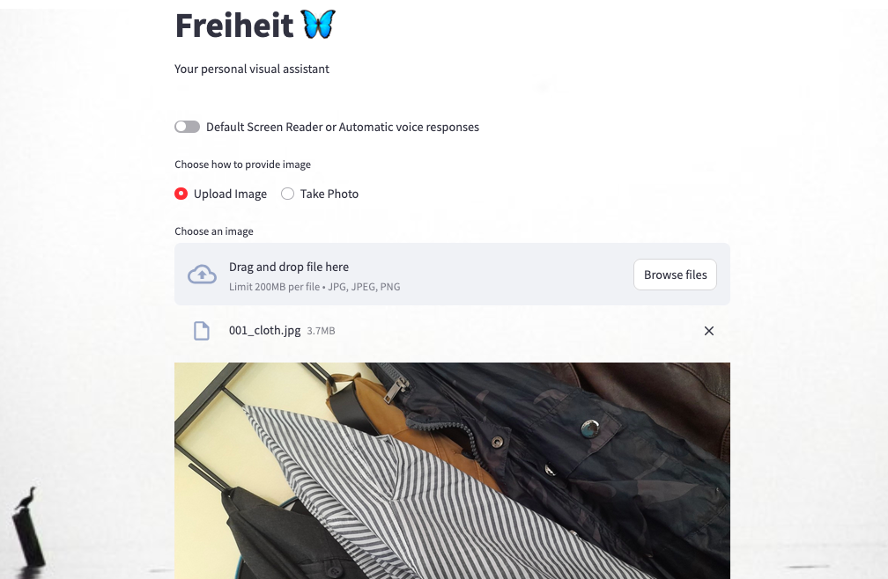
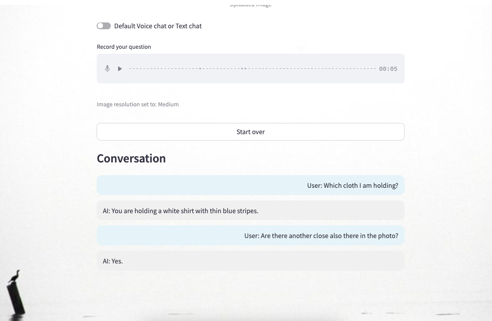
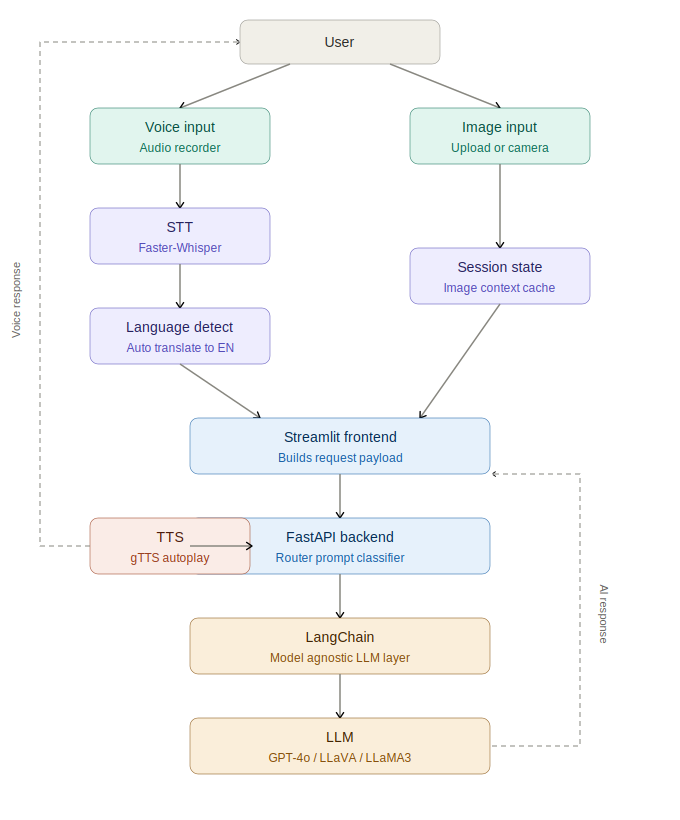
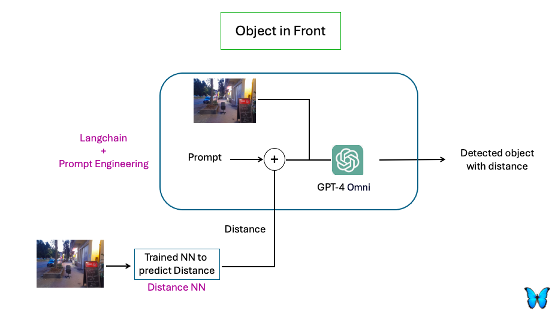
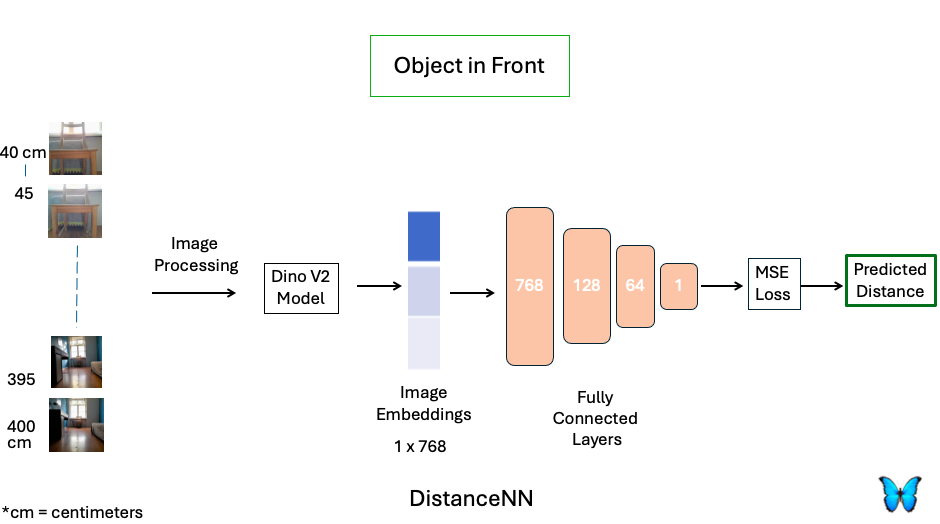

# Freiheit 🦋

### AI Assistant for Blind & Visually Impaired Users

[](https://python.org)
[](https://fastapi.tiangolo.com)
[](https://streamlit.io)
[](https://docker.com)
[](https://langchain.com)
[](https://github.com/astral-sh/uv)

**Freiheit** (German: _Freedom_) is an AI-powered accessibility assistant
designed to help blind and visually impaired individuals with daily tasks,
fostering independence through multimodal large language models.

 <table><tr><td></td><td></td></tr></table>

## Demo

This demo uses Faster-Whisper (state-of-the-art STT engine) for Speech-to-Text with the small size model and INT8 quantization on CPU. so, the transcription speed is reduced accordingly. The GPU support is provided for GPU enabaled systems.

| Version                         | Description                                 | Link                                                    |
| ------------------------------- | ------------------------------------------- | ------------------------------------------------------- |
| v2.0 — Desktop with voice input | FastAPI + Docker + Streamlit                | [Watch ▶️](https://youtu.be/Io9-LBCM3v4)                |
| v2.0 — Desktop with Text input  | FastAPI + Docker + Streamlit                | [Watch ▶️](https://youtu.be/zexlZ2o_TgE)                |
| v2.0 — Mobile                   | Same app on mobile browser (Upload pending) | [Watch ▶️]                                              |
| v1.0 — Legacy                   | DistanceNN + Vision Transformers            | [Watch ▶️](https://www.youtube.com/watch?v=JOuQfZIHabc) |

---

## ✨ Key Features

- 🎤 **Voice & Text Chat** — Multi-turn conversation with image context retained
- 🌍 **Multilingual** — Auto language detection, translation & response
- 📷 **Camera & Upload** — Live photo or image upload support
- 🔊 **TTS/STT** — Faster-Whisper (Speech-to-Text) + gTTS (Text-to-Speech)
- ♿ **Accessibility First** — ARIA labels, screen reader compatible UI
- 🤖 **Model Agnostic** — Supports GPT-4o, LLaVA, LLaMA3 via LangChain

---

## 🏗️ Architecture

### Current Architecture (v2.0)

FastAPI backend + Streamlit frontend, containerised with Docker.



### Tech Stack

| Layer            | Technology                        |
| ---------------- | --------------------------------- |
| Frontend         | Streamlit                         |
| Backend          | FastAPI                           |
| LLM Framework    | LangChain                         |
| Speech-to-Text   | Faster-Whisper (small model, CPU) |
| Text-to-Speech   | gTTS                              |
| Package Manager  | uv                                |
| Containerisation | Docker + Docker Compose           |
| Models Supported | GPT-4o, LLaVA, LLaMA3             |

## 🧠 Engineering Highlights

- **Context-aware conversations** — Image encoded once and reused across
  follow-up questions, reducing API payload size
- **Dynamic resolution inference** — Prompt keywords automatically determine
  image resolution sent to the model
- **Accessibility** — MutationObserver pattern ensures ARIA labels persist
  across Streamlit rerenders (a known Streamlit limitation)
- **Multilingual pipeline** — Detects spoken/typed language, translates to
  English for model inference, responds in user's original language
- **Lean Docker image** — Heavy transformer dependencies removed in v2.0,
  keeping the image production-viable

---

## 🔬 R&D — Previous Research (v1.0)

An earlier version explored distance prediction using a custom-trained CNN
based on **DINOv2 Vision Transformer embeddings** (transfer learning).
The model was trained on a self-created dataset of object distances
(40cm–400cm, 5cm intervals).

**Results achieved in testing:**
| Range | Error |
|---|---|
| 40–100cm | 4.9% |
| 100–200cm | 3.5% |
| 200–300cm | 5.9% |
| 300–400cm | 3.0% |

The model was deprioritised in v2.0 due to:

- Poor generalisation on real-world diverse datasets
- Significant Docker image size increase from transformer dependencies

_Learnings around embeddings, transfer learning, and model evaluation
directly informed the v2.0 architecture decisions._

> 📦 v1.0 with full DistanceNN code preserved at
> [v1.0-legacy release](../../releases/tag/v1.0-legacy)

---

## 🎯 Use Cases

<details>
<summary><b>🚌 Bus Stops</b></summary>

- Reading bus number and destination
- Finding angular position of bus
- Reading departure display boards
</details>

<details>
<summary><b>🚇 Metro Stations</b></summary>

- Reading platform names and directions
- Departure time displays
- Street exit directions
</details>

<details>
<summary><b>👕 Clothing</b></summary>

- Color identification
- Label and tag reading
- Pattern recognition
- Laundry sorting
</details>

<details>
<summary><b>🛒 Shopping / Supermarkets</b></summary>

- Product name reading
- Nutritional information
- Expiry date reading
- Price tag reading
</details>

<details>
<summary><b>🚶 Street Navigation</b></summary>

- Distance estimation to obstacles ahead
- Object identification
</details>

---

## 🚀 Getting Started

### Prerequisites

- Python 3.11
- Docker (recommended) or uv
- Gemini/ OpenAI API key **or** local LLaMA3 via Ollama

### Setup

```bash
# Clone the repo
git clone https://github.com/Mnlohani/Freiheit

# Create a .env file in project root
echo "Gemini_API_KEY=your_key_here" > .env
```

### Run with Docker (Recommended)

```bash
docker compose up --build
```

### Run without Docker

```bash
# Start FastAPI backend
uv run uvicorn src.backend.main:app --host localhost --port 8000 --reload

# Start Streamlit frontend (separate terminal)
uv run python -m streamlit run ./src/frontend/app.py
```

### Using LLaMA3 locally instead of OpenAI

```bash
ollama pull llama3
```

---

## 🗺️ Roadmap

- [ ] Migrate frontend from Streamlit to React
- [ ] Improve screen reader compatibility
- [ ] RAG-based table/nutritional data recognition
- [ ] Multi-model benchmark comparison
- [ ] Expand DistanceNN training dataset for v3.0

---

## 📁 Project Structure

```
Freiheit/
├── data/
│   ├── 01_raw/
│   ├── 02_processed/
│   ├── 03_models/
├── src/
│   ├── backend/          # FastAPI endpoints
│   ├── frontend/         # Streamlit UI
│   ├── models/           # LLM + legacy DistanceNN
│   └── utils/            # Voice, image, LLM utilities
│   └── visualisation
├── assets/               # Images and demo content
├── docker-compose.yml
├── pyproject.toml        # uv dependencies
└── .env                  # API keys (not committed)
```

---

## 🔑 Environment Variables

**Remember to include the file in .gitignore**

```env
OPEN_AI_KEY=your_openai_key
BACKEND_URL=http://localhost:8000
```

---

## 🔬 R&D — Previous Research (v1.0) model

#### Release 1 Architecture:



#### DistanceNN architecure:


_Background image by
[giorgiotrovato](https://unsplash.com/de/@giorgiotrovato)_
