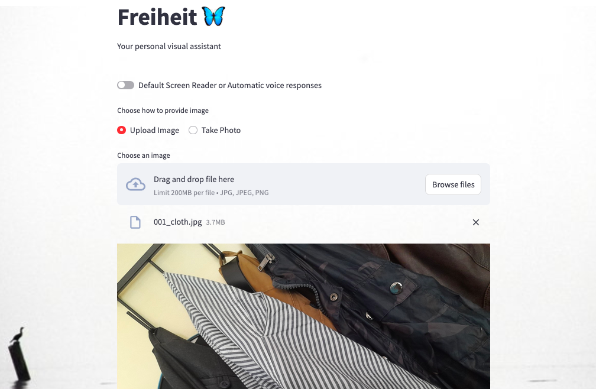
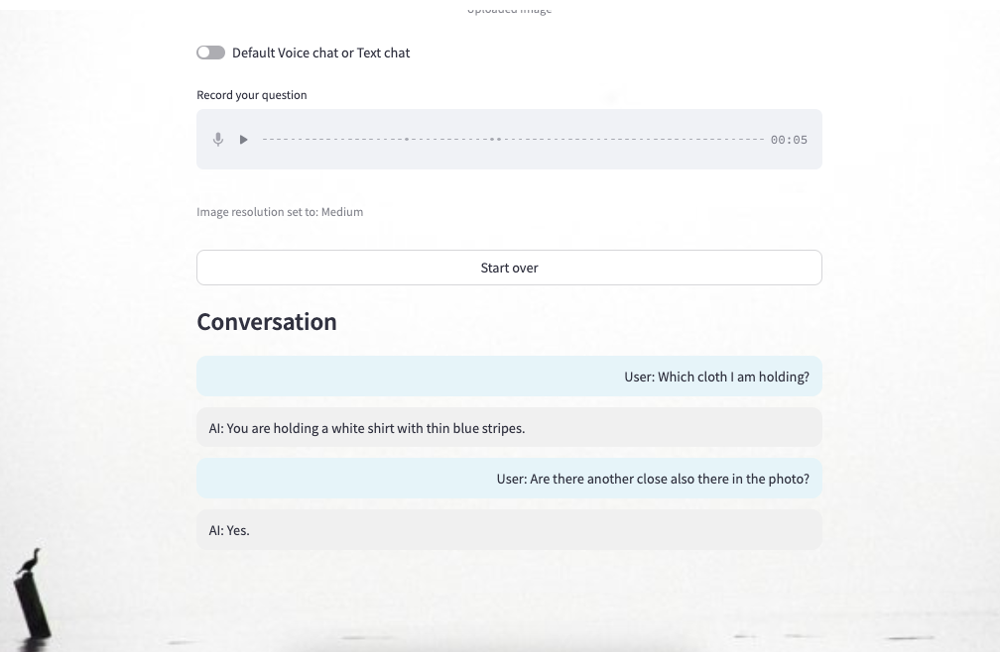
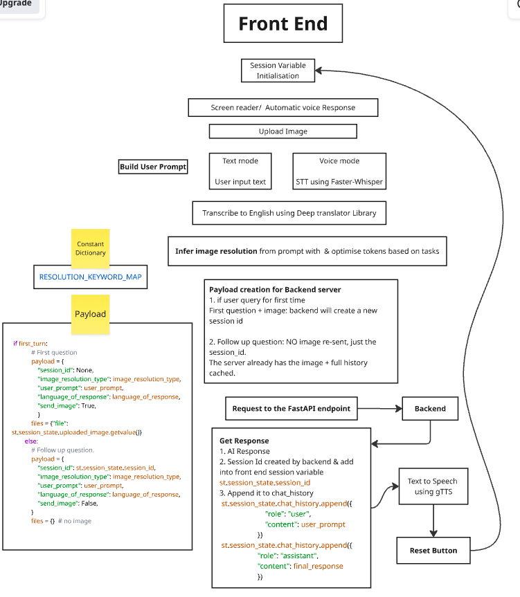
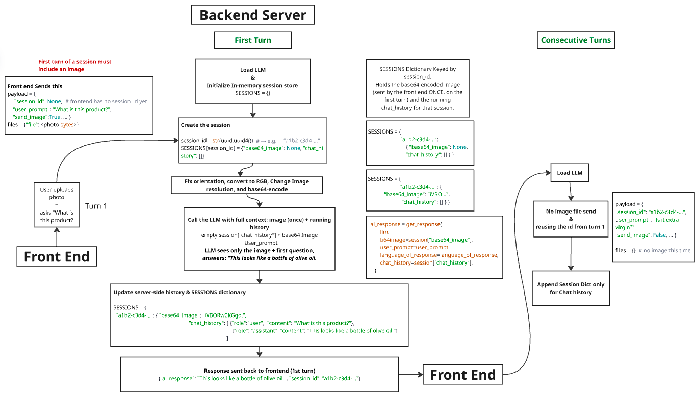
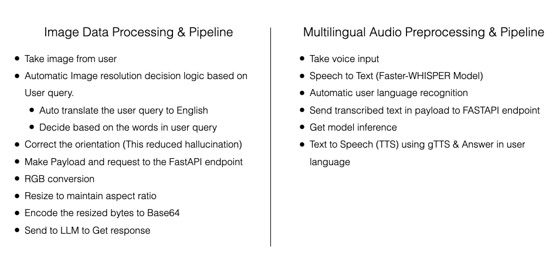
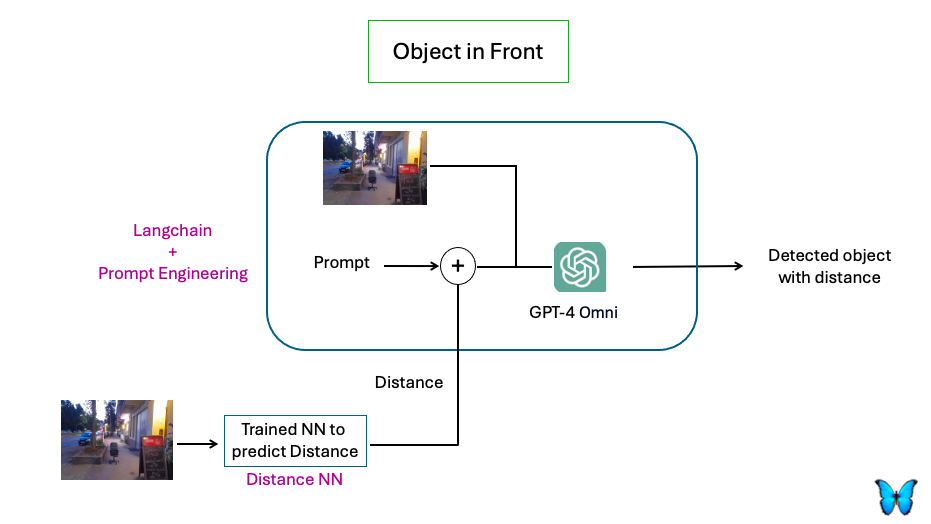
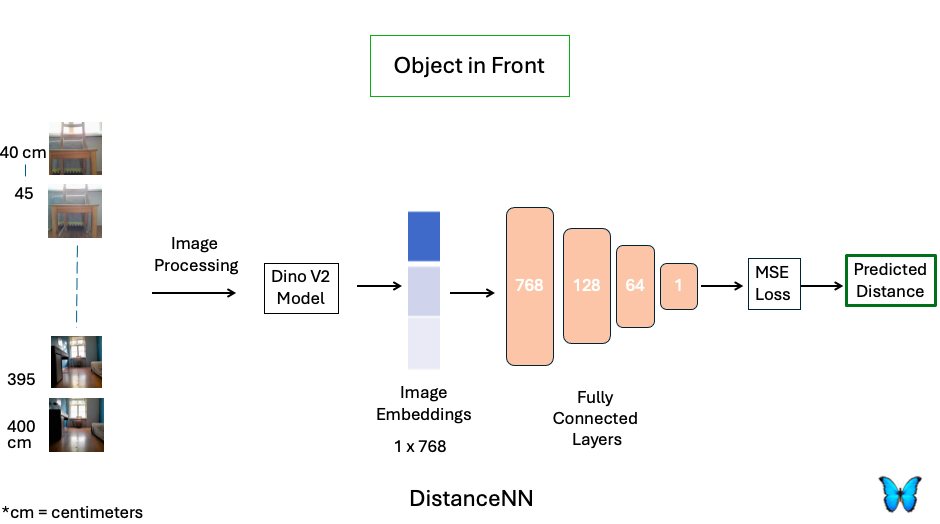

# Freiheit 🦋

### AI Assistant for Blind & Visually Impaired Users

[](https://python.org)
[](https://fastapi.tiangolo.com)
[](https://streamlit.io)
[](https://docker.com)
[](https://langchain.com)
[](https://github.com/astral-sh/uv)

**Freiheit** (German: _Freedom_) is an AI-powered vision assistant
designed to help blind and low-vision individuals to assist with their daily tasks,
fostering independence through multimodal large language models. This product is developed after a deep use case research from various sources including consulting with blind people, videos and research papers. A dataset of 2,000+ real-world images was created specifically
to validate these use cases across diverse environments.

 <table><tr><td></td><td></td></tr></table>

## Demo

Demo videos are recorded on CPU. GPU-enabled systems will have faster
Speach to Text (STT) transcription via automatic hardware detection. To meet a balance between accuracy and speed in CPUs the current state-of-art Faster-Whisper model is used with model size as small, INT8 quantization, beam-size (the number of alternative hypotheses during speech decoding) as 1 and VAD (Voice Activity Detection).

| Version                               | Description                      | Link                                                    |
| ------------------------------------- | -------------------------------- | ------------------------------------------------------- |
| v2.0 — Mobile device with voice input | FastAPI + Docker + Streamlit     | [Watch ▶️](https://youtu.be/DKLlWzGoMVk)                |
| v2.0 — Desktop with voice input       | FastAPI + Docker + Streamlit     | [Watch ▶️](https://youtu.be/OrY7ElUFmAI)                |
| v2.0 — Desktop with Text input        | FastAPI + Docker + Streamlit     | [Watch ▶️](https://youtu.be/zexlZ2o_TgE)                |
| v1.0 — Legacy                         | DistanceNN + Vision Transformers | [Watch ▶️](https://www.youtube.com/watch?v=JOuQfZIHabc) |

---

## ✨ Key Features

- 🎤 **Voice & Text Chat** — Multi-turn conversation with image and chat context retained
- 🌍 **Multilingual** — Auto language detection, translation & response
- 📷 **Camera & Upload** — Live photo or image upload support
- 🔊 **TTS/STT** — Faster-Whisper (Speech-to-Text) + gTTS (Text-to-Speech)
- ♿ **Accessibility First** — ARIA labels, screen reader compatible UI
- 🤖 **Model Agnostic** — Supports Gemini, GPT-4o, LLaVA (LLaMA3) via LangChain

---

## 🏗️ Architecture

### Current Software Architecture (v2.0)

FastAPI backend + Streamlit frontend, containerised with Docker.

## 



### Data Preprocessing (V2.0)



### Tech Stack

| Layer            | Technology                        |
| ---------------- | --------------------------------- |
| Frontend         | Streamlit                         |
| Backend          | FastAPI                           |
| LLM Framework    | LangChain                         |
| Speech-to-Text   | Faster-Whisper (small model, CPU) |
| Text-to-Speech   | gTTS                              |
| Package Manager  | uv                                |
| Containerisation | Docker + Docker Compose           |
| Models Supported | Gemini, GPT-4o, LLaVA, LLaMA3     |

## 🧠 Engineering Highlights

- **Context-aware conversations** — Image encoded once and reused across
  follow-up questions, reducing API payload size
- **Dynamic resolution inference** — Prompt keywords automatically determine
  image resolution sent to the model
- **Accessibility** — MutationObserver pattern ensures ARIA labels persist
  across Streamlit rerenders (a known Streamlit limitation)
- **Multilingual pipeline** — Detects spoken/typed language, translates to
  English for model inference, responds in user's original language
- **Lean Docker image** — Heavy transformer dependencies removed in v2.0,
  keeping the image production-viable

---

## 🔬 R&D — Previous Research (v1.0)

An earlier version explored distance prediction using a custom-trained CNN
based on **DINOv2 Vision Transformer embeddings** (transfer learning).
The model was trained on a self-created dataset of object distances
(40cm–400cm, 5cm intervals).

**Results achieved in testing:**
| Range | Error |
|---|---|
| 40–100cm | 4.9% |
| 100–200cm | 3.5% |
| 200–300cm | 5.9% |
| 300–400cm | 3.0% |

The model was deprioritised in v2.0 due to:

- Poor generalisation on real-world diverse datasets
- Significant Docker image size increase from transformer dependencies

_Learnings around embeddings, transfer learning, and model evaluation
directly informed the v2.0 architecture decisions._

> 📦 v1.0 with full DistanceNN code preserved at
> [v1.0-legacy release](../../releases/tag/v1.0-legacy)

---

## 🎯 Use Cases

<details>
<summary><b>🚌 Bus Stops</b></summary>

- Reading bus number and destination
- Finding angular position of bus
- Reading departure display boards
</details>

<details>
<summary><b>🚇 Metro Stations</b></summary>

- Reading platform names and directions
- Departure time displays
- Street exit directions
</details>

<details>
<summary><b>👕 Clothing</b></summary>

- Color identification
- Label and tag reading
- Pattern recognition
- Laundry sorting
</details>

<details>
<summary><b>🛒 Shopping / Supermarkets</b></summary>

- Product name reading
- Nutritional information
- Expiry date reading
- Price tag reading
</details>

<details>
<summary><b>🚶 Street Navigation</b></summary>

- Distance estimation to obstacles ahead
- Object identification
</details>

<details>
<summary><b> At Home </b></summary>

- Most of all things. Laundry, cloths, medicine, products, fridge
- Object identification
- Tested with all above cases
</details>

---

## 🚀 Getting Started

### Prerequisites

- Python 3.11
- Docker (recommended) or uv
- Gemini/ OpenAI API key **or** local LLaMA3 via Ollama

### Setup

```bash
# Clone the repo
git clone https://github.com/Mnlohani/Freiheit

# Create a .env file in project root
echo "Gemini_API_KEY=your_key_here" > .env
```

### Run with Docker (Recommended)

```bash
docker compose up --build
```

### Run without Docker

```bash
# Start FastAPI backend
uv run uvicorn src.backend.main:app --host localhost --port 8000 --reload

# Start Streamlit frontend (separate terminal)
uv run python -m streamlit run ./src/frontend/app.py
```

### Using LLaMA3 locally instead of OpenAI

```bash
ollama pull llama3
```

---

## 🗺️ Roadmap

- [ ] Migrate frontend from Streamlit to React
- [ ] Improve screen reader compatibility
- [ ] RAG-based table/nutritional data recognition
- [ ] Multi-model benchmark comparison
- [ ] Expand DistanceNN training dataset for v3.0

---

## 📁 Project Structure

```
Freiheit/
├── data/
│   ├── 01_raw/
│   ├── 02_processed/
│   ├── 03_models/
├── src/
│   ├── backend/          # FastAPI endpoints
│   ├── frontend/         # Streamlit UI
│   ├── models/           # LLM + legacy DistanceNN
│   └── utils/            # Voice, image, LLM utilities
│   └── visualisation
├── assets/               # Images and demo content
├── docker-compose.yml
├── pyproject.toml        # uv dependencies
└── .env                  # API keys (not committed)
```

---

## 🔑 Environment Variables

**Remember to include the file in .gitignore**

```env
OPEN_AI_KEY=your_openai_key
BACKEND_URL=http://localhost:8000
```

---

## 🔬 R&D — Previous Research (v1.0) model

#### Release 1 Architecture:



#### DistanceNN architecure:


_Background image by
[giorgiotrovato](https://unsplash.com/de/@giorgiotrovato)_

- What is Whisper model?  
  Whisper is a general-purpose speech recognition model. It is trained on a large dataset of diverse audio and is also a multitasking model that can perform multilingual speech recognition, speech translation, and language identification. A Transformer sequence-to-sequence model is trained on various speech processing tasks, including multilingual speech recognition, speech translation, spoken language identification, and voice activity detection. These tasks are jointly represented as a sequence of tokens to be predicted by the decoder, allowing a single model to replace many stages of a traditional speech-processing pipeline. The multitask training format uses a set of special tokens that serve as task specifiers or classification targets.

- What is Faster-Whisper model?  
  faster-whisper is a reimplementation of OpenAI's Whisper model using CTranslate2, which is a fast inference engine for Transformer models.

- What is CTranslate2?  
  CTranslate2 is a C++ and Python library for efficient inference with Transformer models. The project implements a custom runtime that applies many performance optimization techniques such as weights quantization, layers fusion, batch reordering, etc., to accelerate and reduce the memory usage of Transformer models on CPU and GPU.

- What is quantization?  
  Quantization is the process of reducing the numerical precision of a machine learning model's weights and computations—for example, converting 32-bit floating-point (FP32) values to 16-bit floating-point (FP16) or 8-bit integers (INT8). This reduces memory usage and often speeds up inference, while keeping the model's accuracy nearly the same.

- What is beam_size in Faster-Whisper?
  Beam search is a decoding algorithm used to determine the most likely transcription.
  - Beam Size = 1: This is called greedy decoding. The model simply picks the most probable word at each step.
    Example: I → am → learning → AI
    Fastest, Uses the least memory, May miss a better overall sentence because it never considers alternative paths.
  - beam_size = 5
    The model keeps the 5 most likely sentence candidates while decoding.
    Example:
    Path 1: I am learning AI.
    Path 2: I am studying AI.
    Path 3: I have learned AI.
    Path 4: I am reading AI.
    Path 5: I'm learning AI.  
    Picks sentence with the highest overall probability. Better accuracy, Better for noisy audio, Slower, Uses more memory.

- What is VAD?  
  VAD = Voice Activity Detection. It detects parts of the audio where someone is actually speaking.  
  Example:  
  0-3 sec Silence.  
  3-10 sec Speech.  
  10-15 sec Silence.  
  15-22 sec Speech.
  - Without VAD:  
    Entire audio.
    ↓  
    Whisper processes everything
  - With VAD
    Silence - skipped.  
    Speech ✔ transcribed.  
    Silence - skipped.  
    Speech ✔ transcribed.

- What is Router based Prompt Structure?  
  A router-based prompt structure is a prompt engineering pattern where an AI system first classifies or routes a user's request to the most appropriate prompt, workflow, or specialized model before generating the final response.  
  Other type of Prompt structures:
  - Chain-of-Thought (CoT): The model is instructed to solve a problem step by step. Best for Math, Reasoning
  - Few-shot Prompting: Provide examples before asking the real question.Translation, Classification
  - Zero-shot Prompting, for simple tasks
  - ReAct: Reason + Act (using tools), AI Agents etc. Question -> thought -> observation -> calculaion
  - RAG: Question -> Vector Database -> Retrive relevant document first -> LLM -> Answer
  - Prmpt Chaining: Break a complex task into multiple Prompts. Each prompt does a specific task and then ouutput of previous becomes the input to the next.
  - Tree of Thoughts (ToT): Instead of following oen reasoning path, the model explores multiple possibilities and select the best one. Example, Planning, puzzl solving, strategy tasks
  - Role based Prompting: Assign the model a role.
  - Agentic: Plan and execute tasks Autonomously. AI Copiolts, automation
